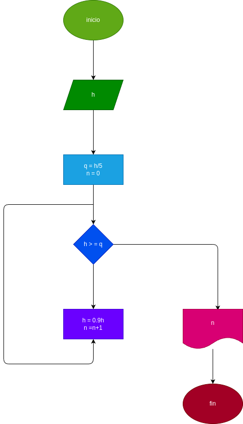

# while_2

# Analisis

Este repositorio contiene un programa en Python que simula el comportamiento de una pelota que se deja caer desde una altura `h` y en cada rebote sube un 10% menos que el anterior. El programa calcula y muestra en qué rebote la pelota no alcanza a subir la quinta parte de la altura inicial.

## Imput
# Processing

1. Se pide la altura inicial `h`.
2. En cada rebote, la pelota sube un 10% menos que la altura anterior.
3. El programa cuenta el número de rebotes hasta que la altura sea menor a `h/5`.
4. Se muestra el número de rebotes en los que esto sucede.

## output
se muestra el resultado 

### Diseño

